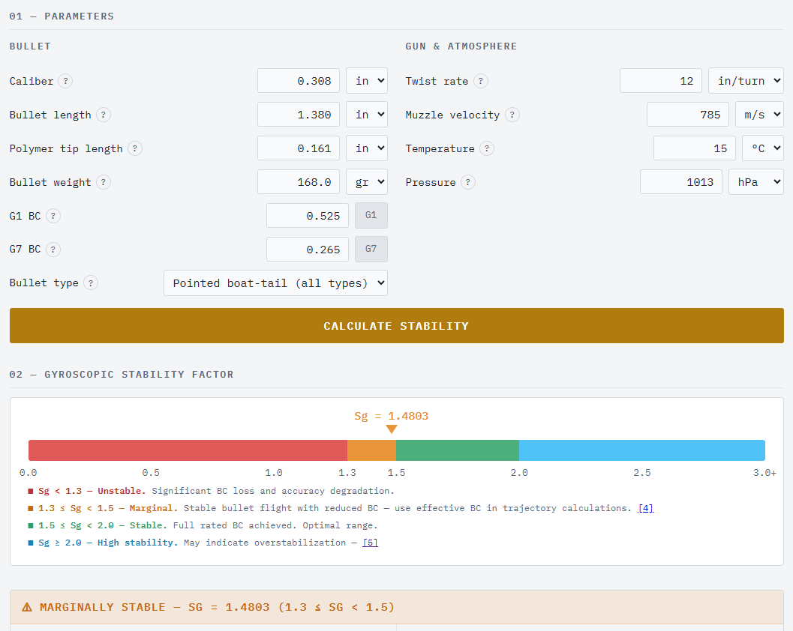
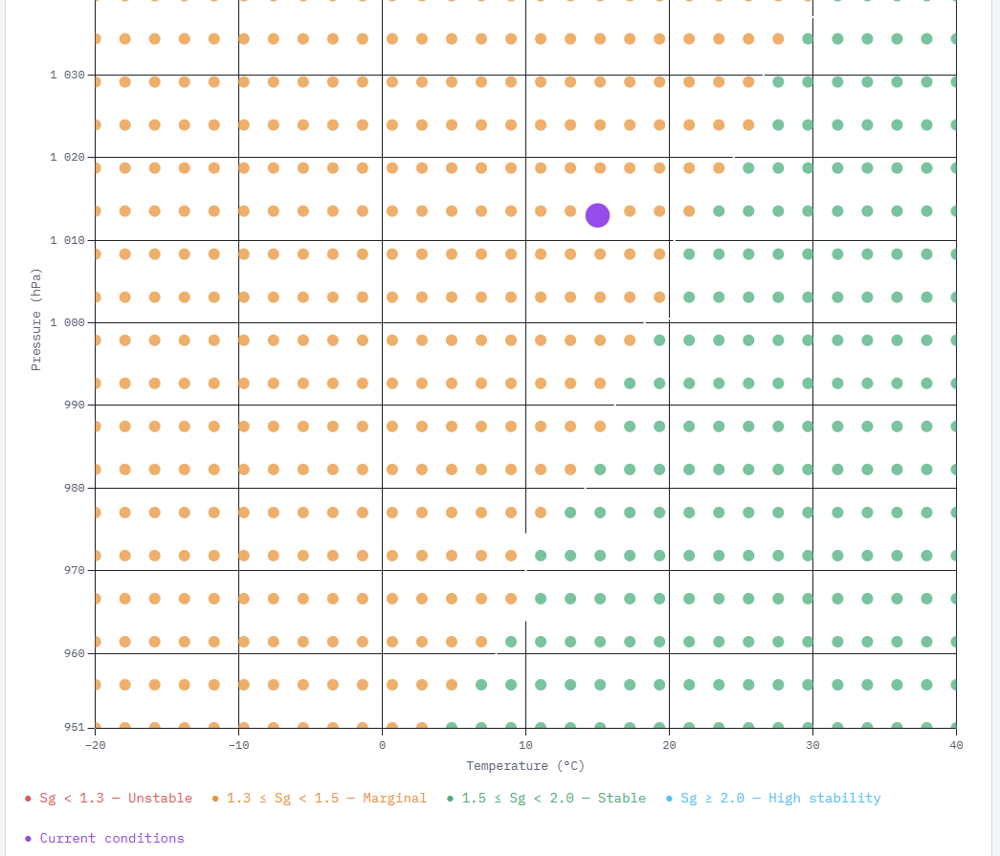

# Josef's Bullet Stability Calculator

A free, browser-based gyroscopic bullet stability calculator for hunters and handloaders. No login, no ads, no install — just open and shoot.

**[Live calculator →](https://jsbartunek.github.io/josefs-stability-calculator/)**

---

## Features

- **Miller Twist Rule** (2005, 2009) — with Courtney–Miller (2012) atmospheric correction (square-root form, consistent with JBM and Berger)
- **Stability zones** — four clearly defined zones: Unstable (Sg < 1.3), Marginal (1.3–1.5), Stable (1.5–2.0), Overstabilized (Sg > 2.0), with drag and nose-up effects explained
- **BC degradation** — quantifies how instability reduces effective ballistic coefficient: BC_eff = BC × max(0, 1 − (1.5 − Sg) × 0.30)
- **G1→G7 conversion** — with bullet-type correction factors based on modern Doppler/radar data from Berger, Hornady, Nosler, and Lapua
- **Flat-base correction** — empirical Sg × 1.15 scaling derived from comparison of Miller's minimum twist predictions against Berger published data for 13 flat-base bullets
- **Spin drift table** — drift at distance due to gyroscopic precession, using Miller's formula with calibrated exponential time-of-flight approximation
- **Transonic distance** — range at which the bullet decelerates to Mach 1.0, estimated via calibrated point-mass drag integration
- **Atmospheric stability heatmap** — Sg across a grid of temperature and pressure combinations (Chart.js), with current conditions marked
- **SI and imperial units** — switch freely
- **Mobile-friendly** — responsive layout, works on phone in the field
- **Settings persistence** — all inputs saved in localStorage

## Validation

Results verified against JBM Stability Calculator and Berger Twist Rate Calculator. G1→G7 conversion factors derived from Doppler/radar data published by Berger, Hornady, Nosler, and Lapua.

## Credits

- [JBM Stability Calculator](http://www.jbmballistics.com) — validation reference
- [Berger Twist Rate Calculator](https://www.bergerbullets.com) — validation reference
- Berger, Hornady, Nosler, Lapua — ballistic coefficient and radar data references
- Developed with the assistance of [Claude](https://www.anthropic.com) by Anthropic

## Companion tool

[Josef's External Ballistics Calculator →](https://jsbartunek.github.io/josefs-external-ballistics/)

---

*Provided for informational and educational purposes only. Always verify results and follow applicable firearms laws and hunting regulations.*
